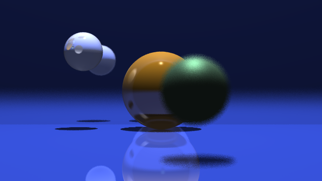

Ray Tracer built in C++. Images are rendered using the following features:

1. Spotlight light source: include/SpotLight.h, src/SpotLight.cpp
    
2. Refraction/Transparency/Fresnel: include/refract.h, src/refract.cpp, src/raycolor.cpp (is_transmissive and is_dielectric if statements)
 
3. Multithread support: main.cpp
    
3. Depth of field: main.cpp
    
4. Glossy reflection: src/raycolor.cpp (is_glossy if statement)
    
5. Translucent Shadows: function shadow_hit in src/blinn_phong_shading.cpp
    - used so that transulcent/transparent objects don't have opaque shadows
    - essentially multiplying pixel color of the point by the "kt" transmissive color of each object on the path to the light, effectively darkening color if transulucent object in path or completely black hard shadow if opqaue object in the way
    
    
cmake command to build
> mkdir build && cd build

> cmake .. -DTHREAD=ON -DCMAKE_BUILD_TYPE=Release

<h3> Rendered Images </h3>

FINAL_IMAGE

dof_near

dof_far

rgb_mirror

